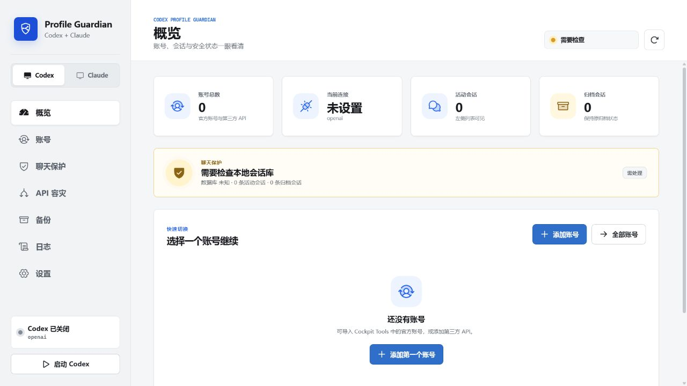
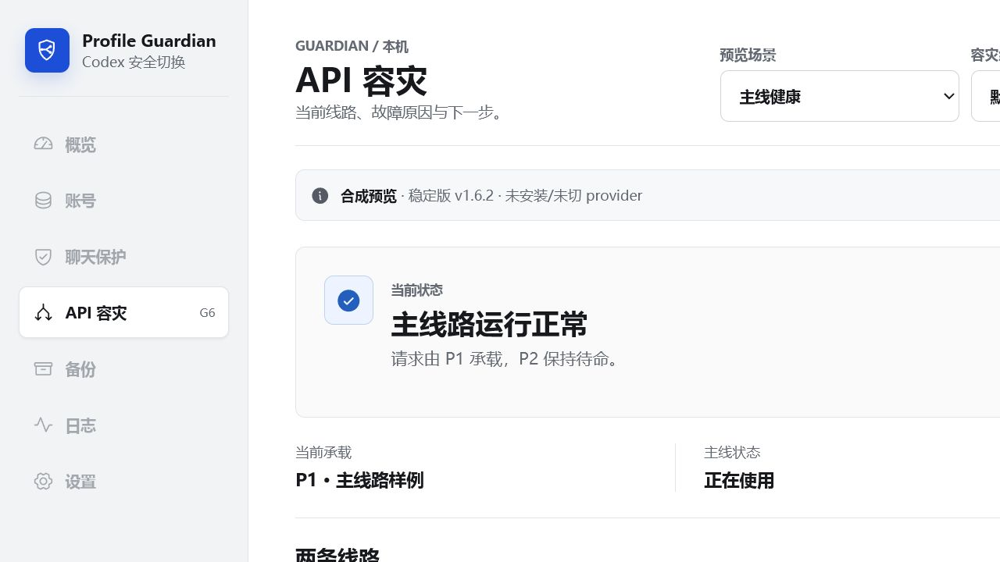
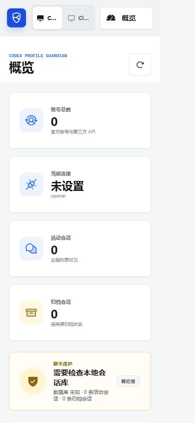

# Codex Profile Guardian

<p align="center">
  
</p>

Codex Profile Guardian 是一个面向 Windows 的本地管理工具，用于安全管理 Codex 官方账号、OpenAI-compatible API 档案、共享聊天保护和主备 API 容灾网关。应用也可独立管理 Claude Desktop 的原生 Anthropic Messages API 供应商，不依赖 CC Switch 运行。

## 当前状态

- 当前真实安装版：`v1.7.0`；不可覆盖的回滚基线仍为 `v1.6.2`。
- `main`：包含尚未安装或发布的下一版本开发工作，不应直接描述为当前安装版。
- 首发目标：用户自己的 Windows 本地电脑。
- Linux/NAS：代码和等价运行时测试已存在，但没有完成真实 NAS 现场验收，当前仅为实验性扩展。
- 当前仓库没有配置 Git 远程地址，也不会自动推送或发布。

`v1.7.0` 的 Windows 后台注册、安装、升级、卸载和回滚已经验收；真实容灾组/provider 切入及后续新版本安装仍需当次明确授权。详细清单见 [docs/PUBLIC-RELEASE-CHECKLIST.md](docs/PUBLIC-RELEASE-CHECKLIST.md)。

## 核心能力

### 稳定版 `v1.6.2`

- 保存、编辑、测试和切换 Codex 官方账号与 OpenAI-compatible API 档案。
- 使用当前 Windows 用户的 DPAPI 保护登录缓存和 API Key。
- 切换前创建回滚备份，并保护 Codex 配置、SQLite、索引和归档状态。
- 兼容新版 `ChatGPT.exe` / Codex Windows App 的关闭与重新启动。
- 展示官方账号会员等级和每周额度。
- 支持经明确启用的 SSH 一次性同步；这不等于 NAS 常驻容灾网关。

### `main` 中尚未发布的容灾能力

- 固定本地 `guardian_gateway` provider，日常主备切换只发生在网关内部。
- 主线路一次、备用线路一次的有界尝试预算。
- Responses API SSE/JSON 完整缓冲；上游响应完整前不向 Codex 提交模型事件。
- 401、403、429、网络、超时和 5xx 的分类、熔断、半开和恢复。
- 工具调用完整性保护、客户端取消和 `delivery_uncertain` 边界。
- 与 UI 分离的 Windows Gateway 生命周期、固定 loopback 端口和控制令牌。
- 灰白/黑灰界面，蓝色用于操作与当前状态，黄色用于提醒和故障。
- Claude Desktop 供应商 CRUD、DPAPI 凭据、专属 3P profile、加密回滚与官方模式恢复。
- 可选的一次性 CC Switch 当前供应商迁移；迁移后及日常运行不访问 CC Switch。
- 官方账号额度页面可见时每 60 秒同步，重新聚焦时立即同步，并显示每周额度与重置卡次数。
- 纯 allowlist、内存生成的脱敏诊断 ZIP。

## 关键安全边界

- 容灾数据面不得读取或修改 Codex 的聊天正文、归档、`state_5.sqlite*` 或 `session_index.jsonl`。
- 日志和诊断包不得保存 prompt、response、工具参数、Authorization、Cookie 或真实 Key。
- 官方账号继续使用官方认证直连；Guardian 不反代 OAuth。
- 只有在上游完整响应尚未向 Codex 提交时，才允许切换备用线路。
- 提交阶段中断会标记为 `delivery_uncertain`，不会自动重发，也不宣称严格 exactly-once。
- Guardian 只写自己的 Claude 3P profile，不打开或覆盖其他 profile；一次性 CC Switch 迁移必须由用户显式确认，并且只接受原生 Anthropic Messages API。

更多安全说明见 [SECURITY.md](SECURITY.md)。

## 本地开发

要求：

- Windows 10/11
- Python 3.12
- Node.js 与 pnpm

安装依赖并验证：

```powershell
pnpm install --frozen-lockfile
pnpm run build
.\.venv\Scripts\python.exe -m pip install -r requirements.txt
.\.venv\Scripts\python.exe -B -m unittest discover -s tests -v
```

启动开发页面：

```powershell
pnpm run dev
```

## UI 预览







所有自动化测试默认使用本地 mock、临时目录和假凭据。不要用真实 API Key 替代 fixture 测试。

公开仓库准备扫描：

```powershell
.\.venv\Scripts\python.exe -B tools\public_release_audit.py --allow-no-license
```

最终公开前移除 `--allow-no-license`；缺少所有者选定的 `LICENSE` 时扫描必须失败。

## 数据与构建输出

以下内容不应提交到 Git：

- `.venv/`、`node_modules/`、构建缓存；
- `build/`、`dist/`、`output/`、`_tmp/`、`qa/`；
- `profiles.json`、`auth.json`、SQLite、日志、诊断包和 DPAPI/密钥文件；
- 真实聊天、归档、索引、SSH 目标或用户专属绝对路径。

## 许可证

本项目使用 [MIT License](LICENSE)。

## 第三方参考

UI 信息架构和部分可靠性概念参考了 [CC Switch](https://github.com/farion1231/cc-switch) `v3.16.5`。当前实现只做独立研究与实现，没有复制其品牌资产或实质源码。若以后引入第三方实质代码，必须同时补充对应许可证和 `THIRD_PARTY_NOTICES.md`。
