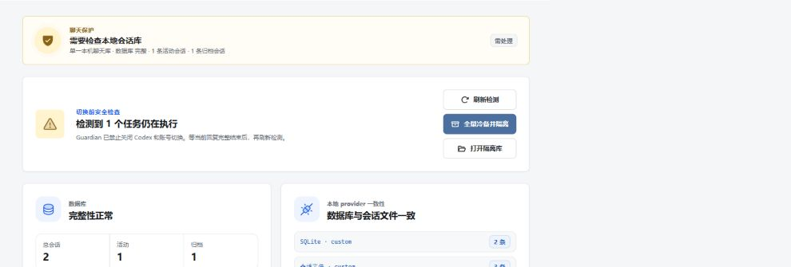
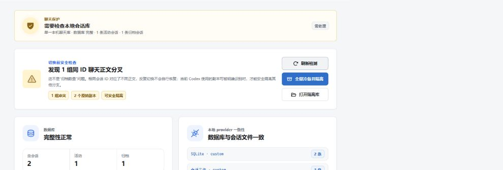
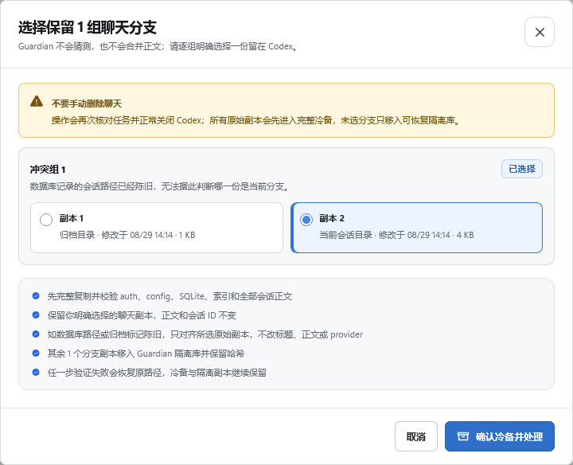
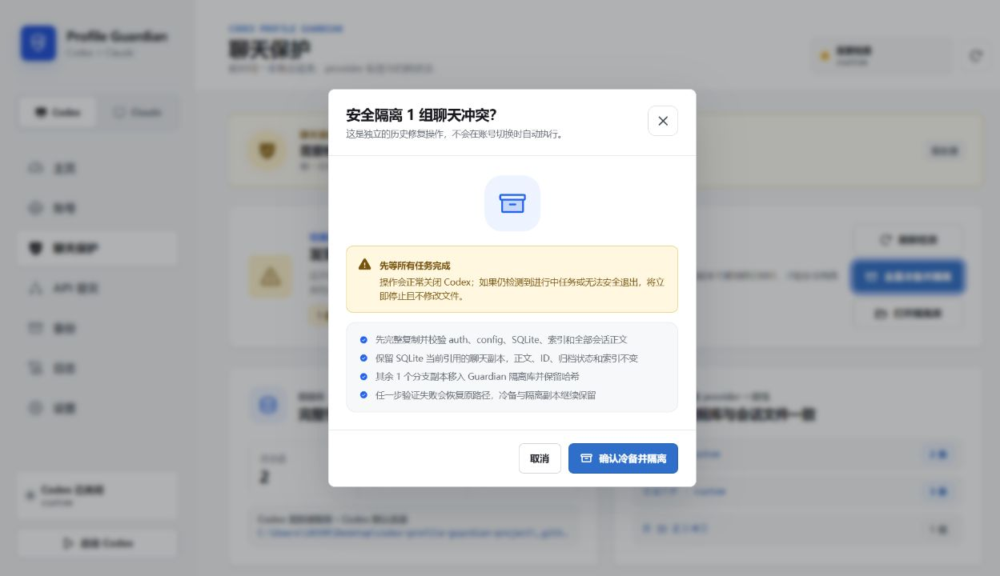

# Guardian 聊天冲突安全处理图文教程

适用症状：点击“安全切换”后提示“请求未完成”，日志出现“正文冲突的重复会话 ID”，账号始终没有切换成功。

## 先说结论

这不是网络偶发错误，也不是多点几次就能成功。

Guardian 发现了至少两个物理会话文件，它们的 `session_meta.payload.id` 相同，但后续聊天正文不同。系统无法擅自判断哪一份该覆盖另一份，因此旧版会中止切换并回滚。日志写明“未选择或删除任何文件”时，原始聊天副本仍在。

“保持 13 条归档会话状态”只代表归档数量，不代表有 13 组冲突。

## 一、怎样确认是这个问题

旧版点击“安全切换”后如果失败，请打开“日志”，找这一句：

> 切换失败并已回滚：发现 1 个正文冲突的重复会话 ID，已中止迁移，未选择或删除任何文件。

右下角的旧版通用提示信息不足，不能据此判断是 Key、网络还是聊天冲突：

> 请求未完成，请检查输入和当前状态。

顶部的 `custom` 只是当前配置中的 provider 名称，不等于本次切换成功：

## 二、为什么折腾两小时也不会成功

如果不同时间的多次尝试都出现完全相同的错误文字，并且每次都是先创建普通切换备份、随后遇到同一组冲突并回滚，就说明这是确定性冲突，不是刷新或等待能消失的瞬时错误。

只要冲突副本还在 Codex 扫描目录中，重启、刷新、重新导入账号或再次点击切换都不会改变结果。旧版的 HTTP 403 连通性日志也不是这次切换被拦截的直接原因；真正的阻断原因是 `profile.switch` 日志里的正文冲突。

## 三、是不是“任务执行中切换”造成的

有可能是形成条件之一，但仅凭现有日志不能断言这是唯一原因。

一般需要同时发生两件事：

1. 同一个会话 ID 出现了第二个物理副本，例如迁移、恢复、同步、复制或异常中断留下副本。
2. 两个副本后来分别继续写入，最终正文不再是彼此的完整前缀。

如果任务还在输出时关闭或切换，确实会放大第二步的风险。因此修复版把“检测进行中任务”设为切换和历史修复的第一道门禁。

## 四、仍在使用 v1.10.2 或更旧版本时怎么操作

1. 看到上述 `profile.switch` 日志后立刻停止重试。
2. 等当前 Codex 回复、工具调用和终端任务全部结束。
3. 手动正常退出 Codex；不要使用任务管理器强制结束进程。
4. 保留失败日志和最近一次“已创建安全备份”的截图。
5. 不要手动删除、合并、重命名 `.codex\sessions`、`.codex\archived_sessions`、`state_5.sqlite*` 或 `session_index.jsonl`。
6. 不要继续点击旧版“修复共享历史”；它会遇到同一正文分叉门禁。
7. 如果日志明确写着“已回滚”，先刷新 Guardian 并确认仍是切换前账号，再继续使用；在冲突处理完成前不要再次切换。
8. 不要像普通文件一样手动删除“分叉聊天”。升级到 `v1.10.3` 或更高版本后，再按下一节在 Guardian 内处理。

如果已经手动删除了某个分支：先不要继续清理。只有完整冷备、Guardian 隔离库或其他可信备份仍保留该原件时，才有可恢复来源；新版不能凭空还原已经永久删除且没有备份的正文。

## 五、修复版的正确操作

### 第 1 步：先结束所有任务

进入“聊天保护”并点击“刷新检测”。如果有任务执行中，Guardian 会禁止关闭 Codex、禁止账号切换，并禁用冲突隔离按钮。

等当前回复完整结束后，再点一次“刷新检测”。

### 第 2 步：确认冲突数量和处理方式

任务结束后，页面会显示正文分叉组数、物理副本数，以及 SQLite 能否唯一识别当前副本。

页面会出现两种安全流程：

1. 显示“可自动保留”：SQLite 的路径和归档状态唯一匹配一个副本，可以点击“全量冷备并隔离”。
2. 显示“需选择保留副本”：数据库路径陈旧、缺失、归档状态不一致或缺少对应 thread 行。点击“选择保留副本”，由用户逐组确认；Guardian 不会预选，也不会猜测。

如果显示“缺少 SQLite，已停止”，按钮会明确变成灰色。先确认 Guardian 定位的是 Codex 实际使用的 `state_5.sqlite`，不要手工删除聊天文件。

### 第 3 步：无法自动识别时，逐组选择保留副本

每份副本只显示脱敏信息：当前/归档目录、最后修改时间、文件大小，以及数据库路径是否指向它；界面不显示 thread ID、文件绝对路径或聊天正文。

根据你最后使用的分支，逐组选择一份留在 Codex。其余副本不会被删除，而是先进入完整冷备，再进入 Guardian 可恢复隔离库。如果无法根据这些信息判断，应取消操作并保留现场，不要盲选。

### 第 4 步：阅读确认框并明确确认

确认后，Guardian 按以下顺序执行：

1. 再次检查是否存在进行中任务，并只尝试正常关闭 Codex；绝不强制结束进程。
2. 完整复制并校验 `auth`、`config`、原始 SQLite、WAL/SHM、SQLite 逻辑备份、索引和全部会话正文。
3. 自动模式保留 SQLite 唯一匹配的副本；选择模式只保留用户明确勾选的原始副本，正文和会话 ID 不变。
4. 如果 SQLite 已有该会话行但路径或归档标记陈旧，只把 `rollout_path/archived` 对齐到所选原始副本；标题、正文、provider 和索引不改。数据库缺行时不伪造新行。
5. 把其他正文分支复制到 Guardian 隔离库，核对哈希后再移出 Codex 扫描目录。
6. 复核所有未隔离会话文件、SQLite 完整性、预期数据库字段和索引；提交还会绑定刚才的检测版本，状态变化时要求重新选择。
7. 任一步失败，同时恢复已移动文件和已调整的数据库引用；完整冷备和隔离副本仍然保留。

### 第 5 步：验收后再切换

隔离成功后：

1. 再点“刷新检测”，确认正文冲突变为 0。
2. 点击“打开隔离库”，确认隔离目录和 `manifest.json` 存在。
3. 在日志中确认“聊天冲突处理前完整冷备已完成”和“已按明确选择保留聊天副本”。
4. 回到“账号”页重新发起切换。
5. Codex 启动后，核对原活动任务、归档任务和当前账号是否正确。

## 六、需要发给维护者什么

可以发送：Guardian 版本号、错误时间、`profile.switch` / `history.conflict_isolate` 的脱敏日志截图、冲突组数，以及页面显示“可自动保留”“需选择保留副本”还是“缺少 SQLite”。

不要发送：`auth.json`、API Key、Token、Cookie、SQLite 数据库、完整会话 JSONL 或聊天正文。
